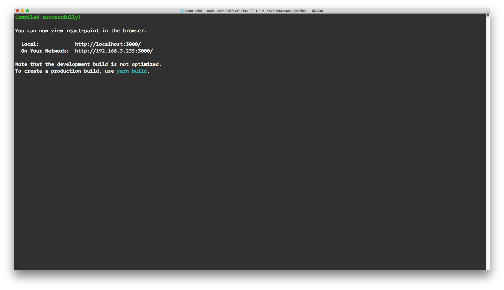
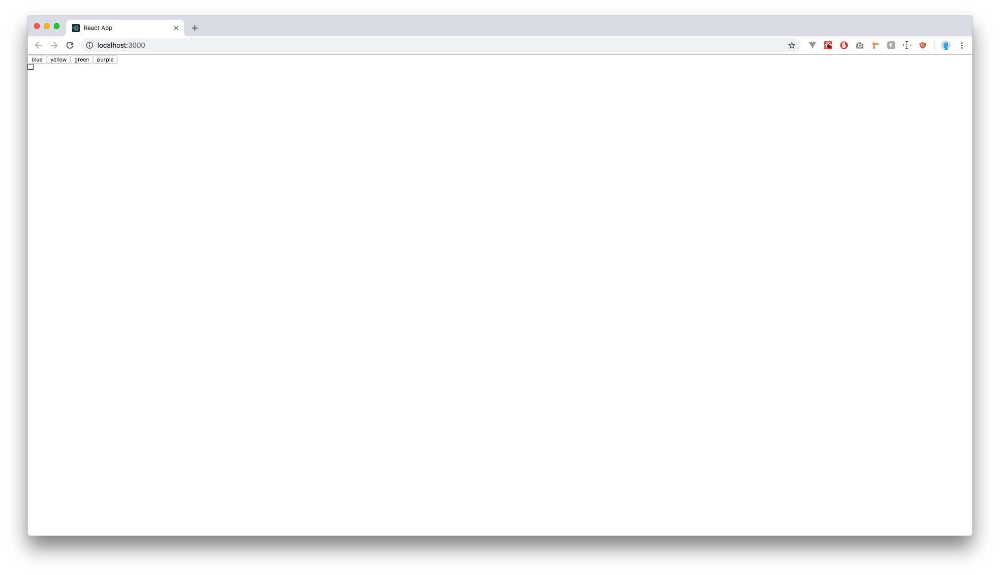
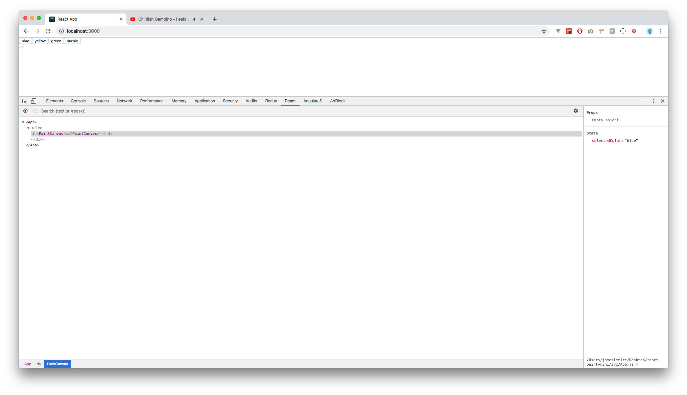
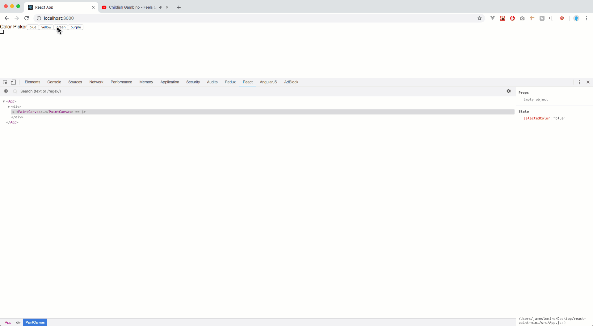
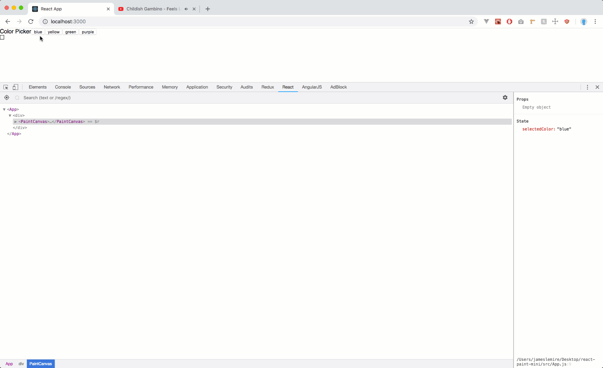
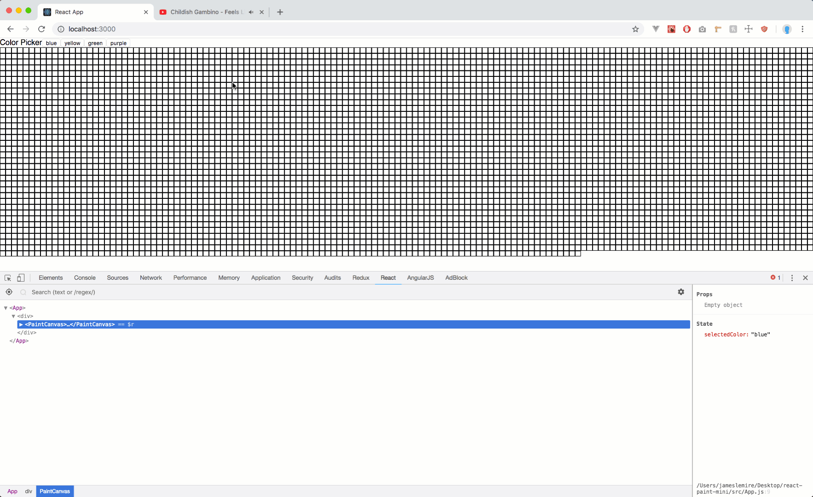

# Project Summary

In this project, we will create a paint app that will allow us to practice passing data from a parent component to a child component via props. We will also learn how to update a parent component's state from a child component.

## Setup

- `cd` into the project directory.
- Run `create-react-app ./`.
- Remove the service worker from `src/index.js`:
  - Delete `import registerServiceWorker from './registerServiceWorker';`
  - Delete `registerServiceWorker();`
- Run `npm start`.
- In a seperate terminal, `cd` into the project directory.



## Step 1

### Summary

In this step, we will create the basic structure for the components we will be using.

### Instructions

- Create a components folder inside of src.
- Inside the components folder, create the following component files:
  - PaintCanvas.js
  - ColorPicker.js
  - Square.js
- Create a `class component` for `Square.js` that renders a `div` with the following styles
  - `{ height: 10, width: 10, border: '1px solid black }`
- Create a `stateless functional component` for `ColorPicker.js` that renders a `div` with four buttons:
  - The first button should say `blue`.
  - The second button should say `yellow`.
  - The third button should say `green`.
  - The fourth button should say `purple`.
- Create a `class component` for `PaintCanvas.js` that will render both the `ColorPicker` component and the `Square` component.
- In `src/App.js`, render the `PaintCanvas` component.

### Solution

<details>

<summary> <code> ./src/App.js </code> </summary>

```js
import React, { Component } from "react";

import PaintCanvas from "./components/PaintCanvas";

class App extends Component {
  render() {
    return (
      <div>
        <PaintCanvas />
      </div>
    );
  }
}

export default App;
```

</details>

<details>

<summary> <code> ./src/components/PaintCanvas.js </code> </summary>

```js
import React, { Component } from "react";
import ColorPicker from "./ColorPicker";
import Square from "./Square";

export default class PaintCanvas extends Component {
  render() {
    return (
      <div>
        <ColorPicker />
        <Square />
      </div>
    );
  }
}
```

</details>

<details>

<summary> <code> ./src/components/ColorPicker.js </code> </summary>

```js
import React from "react";

export default function ColorPicker(props) {
  return (
    <div>
      <button>blue</button>
      <button>yellow</button>
      <button>green</button>
      <button>purple</button>
    </div>
  );
}
```

</details>

<details>

<summary> <code> ./src/components/Square.js </code> </summary>

```js
import React, { Component } from "react";

export default class Square extends Component {
  render() {
    return (
      <div
        style={{
          height: 10,
          width: 10,
          border: "1px solid black"
        }}
      />
    );
  }
}
```

</details>



## Step 2

### Summary

In this step, we will update the `PaintCanvas` component to be use state to keep track of the current selected color.

### Instructions

- Add a `constructor` method to PaintCanvas.
  - Call the `super()` method.
  - Create an initial state with the following properties:
    - `selectedColor` withh a value of `'blue'`.
- Create a method to update the selected color on the component's state.
  - Name the method `changeSelectedColor`.
  - The method will take in a color as a parameter and use `this.setState` to update the `selectedColor` property on state.
  - Rememer to bind `this`!

### Solution

<details>

<summary> <code> ./src/components/PaintCanvas.js </code> </summary>

```js
import React, { Component } from "react";
import ColorPicker from "./ColorPicker";
import Square from "./Square";

export default class PaintCanvas extends Component {
  constructor() {
    super();

    this.state = {
      selectedColor: "blue"
    };

    this.changeSelectedColor = this.changeSelectedColor.bind(this);
  }

  changeSelectedColor(color) {
    this.setState({
      selectedColor: color
    });
  }

  render() {
    return (
      <div>
        <ColorPicker />
        <Square />
      </div>
    );
  }
}
```

</details>



## Step 3

### Summary

In this step, we will make it so when we click on a color in the `ColorPicker` component, it will updated the `selectedColor` property on the `PaintCanvas` component's state.

### Instructions

- Open `PaintCanvas.js`
- Pass the `changeSelectedColor` method as a prop on `ColorPicker`.
  - Name the prop `handleColorClick`.
- Open `ColorPicker.js`
- Add an `onClick` event listener to each of the buttons.
  - The event listener should be an arrow function that will invoke the `handleColorClick` method from the props.
  - Make sure to pass in the color of the button as an argument for `handleColorClick`.

### Solution

<details>

<summary> <code> ./src/components/PaintCanvas.js </code> </summary>

```js
import React, { Component } from "react";
import ColorPicker from "./ColorPicker";
import Square from "./Square";

export default class PaintCanvas extends Component {
  constructor() {
    super();

    this.state = {
      selectedColor: "blue"
    };

    this.changeSelectedColor = this.changeSelectedColor.bind(this);
  }

  changeSelectedColor(color) {
    this.setState({
      selectedColor: color
    });
  }

  render() {
    return (
      <div>
        <ColorPicker handleColorClick={this.changeSelectedColor} />
        <Square />
      </div>
    );
  }
}
```

</details>

<details>

<summary> <code> ./src/components/ColorPicker.js </code> </summary>

```js
import React from "react";

export default function ColorPicker(props) {
  return (
    <div>
      Color Picker
      <button onClick={() => props.handleColorClick("blue")}>blue</button>
      <button onClick={() => props.handleColorClick("yellow")}>yellow</button>
      <button onClick={() => props.handleColorClick("green")}>green</button>
      <button onClick={() => props.handleColorClick("purple")}>purple</button>
    </div>
  );
}
```

</details>

<br/>


## Step 4

### Summary

In this step, we'll use the `selectedColor` property on the `PaintCanvas` component's stateto change the background color of the `Square` component.

### Instructions

- Open `PaintCanvas.js`.
- Pass the `selectedColor` property on state to the `Square` component via props.
  - Name the prop `selectedColor`.
- Open `Square.js`.
- Create a `constructor` method.
  - Remember to invoke the `super()` method.
  - Initialize state with a property called `backgroundColor` with a value of `'white'`.
- Update the `div`'s style object in the render method to use another property:
  - `background: this.state.backgroundColor`.
- Create a new method called `changeBackgroundColor`.
  - This method should update the `backgroundColor` property on state to the value of `selectedColor` on props.
  - Make sure to bind `this`.
- Update the `div` in the `render` method to use an `onClick` event listener that calls our new `changeBackgroundColor` method.

### Solution

<details>

<summary> <code> ./src/components/PaintCanvas.js </code> </summary>

```js
import React, { Component } from "react";
import ColorPicker from "./ColorPicker";
import Square from "./Square";

export default class PaintCanvas extends Component {
  constructor() {
    super();

    this.state = {
      selectedColor: "blue"
    };

    this.changeSelectedColor = this.changeSelectedColor.bind(this);
  }

  changeSelectedColor(color) {
    this.setState({
      selectedColor: color
    });
  }

  render() {
    return (
      <div>
        <ColorPicker handleColorClick={this.changeSelectedColor} />
        <Square selectedColor={this.state.selectedColor} />
      </div>
    );
  }
}
```

</details>

<details>

<summary> <code> ./src/components/Square.js </code> </summary>

```js
import React, { Component } from "react";

export default class Square extends Component {
  constructor() {
    super();

    this.state = {
      backgroundColor: "white"
    };

    this.changeBackgroundColor = this.changeBackgroundColor.bind(this);
  }
  changeBackgroundColor() {
    this.setState({
      backgroundColor: this.props.selectedColor
    });
  }

  render() {
    return (
      <div
        style={{
          height: 10,
          width: 10,
          border: "1px solid black",
          background: this.state.backgroundColor
        }}
        onClick={this.changeBackgroundColor}
      />
    );
  }
}
```

</details>

<br />


## Step 5

### Summary

In this step, we will add more `Square` components to the screen to create a canvas we can paint on.

### Instructions

- Open `PaintCanvas.js`.
- Create a new method called `draw`.
  - Use a for loop that creates 5000 instances of the `Square` component and passes down a `selectedColor` prop that equals the value of `selectedColor` on `state`.
  - The method should return the array of 5000 `Square` components.
- Replace the single render of `<Square selectedColor={this.state.selectedColor} />` with the invocation of the new `draw` method.

### Solution

<details>

<summary> <code> ./src/components/PaintCanvas.js </code> </summary>

```js
import React, { Component } from "react";
import ColorPicker from "./ColorPicker";
import Square from "./Square";

export default class PaintCanvas extends Component {
  constructor() {
    super();

    this.state = {
      selectedColor: "blue"
    };

    this.changeSelectedColor = this.changeSelectedColor.bind(this);
  }

  changeSelectedColor(color) {
    this.setState({
      selectedColor: color
    });
  }

  draw() {
    let squares = [];
    for (var i = 0; i < 5000; i++) {
      squares.push(<Square selectedColor={this.state.selectedColor} />);
    }

    return squares;
  }

  render() {
    return (
      <div>
        <ColorPicker handleColorClick={this.changeSelectedColor} />
        <div style={{ display: "flex", flexWrap: "wrap" }}>{this.draw()}</div>
      </div>
    );
  }
}
```

</details>

<br />


## Black Diamond

Make it so when you click down on the mouse, it will change the color of all of the squares that the mouse enters until you release the mouse. A continuous painting motion.

## Contributions

If you see a problem or a typo, please fork, make the necessary changes, and create a pull request so we can review your changes and merge them into the master repo and branch.

## Copyright

© DevMountain LLC, 2017. Unauthorized use and/or duplication of this material without express and written permission from DevMountain, LLC is strictly prohibited. Excerpts and links may be used, provided that full and clear credit is given to DevMountain with appropriate and specific direction to the original content.

<p align="center">

</p>
